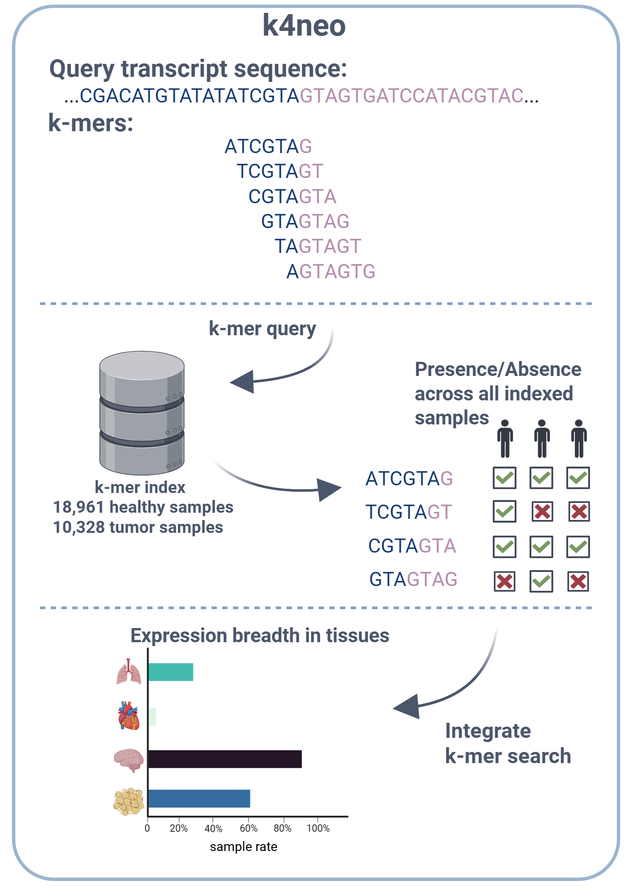

<p align="center">
    
</p>

## k4neo: k-mer indexing for neoantigen annotation

<!-- badges: start -->


[](https://polyformproject.org/licenses/noncommercial/1.0.0/)
[](https://snakemake.readthedocs.io)
[](https://github.com/TRON-Bioinformatics/k4neo)

<!-- badges: end -->

**Documentation**: https://tron-bioinformatics.github.io/k4neo

**A modern k-mer based approach to predict tumor-specificity by screening (novel) transcript sequences in healthy and tumor tissue RNA-seq.**

k4neo is a mapping-free and transcript-class agnostic tool designed to assess tumor specificity at the RNA level. By leveraging a modular architecture, k4neo allows for the efficient screening of candidate sequences against large-scale sequencing cohorts—including 18,960 samples across 51 different healthy tissue types and 10,320 tumor tissues.

The tool is capable of accurately classifying a wide range of neoantigen candidates by their tumor specificity, including:

* Somatic and germline variants 
* Gene fusions 
* Isoforms and splice junctions 

k4neo serves as an efficient first-line filter to prioritize tumor-specific candidates which can then be further validated at the protein and cell-surface levels.


## 🔧 Features

- ⚡ Fast k-mer based expression breadth annotation across tumor and normal samples.
- 🐍 Developed in Python.
- 🔁 Workflow management via Snakemake.
- 📊 Optimized for tumor-specificity analysis of (neo)antigen candidates.
- 🧪 Experimental support for semi-quantitative expression and k-mer uniqueness annotation (relative to genome/transcriptome).

## Pre-built k-mer indices

> [!IMPORTANT]
> We only provide pre-built indices for SRA samples. Indices for GTEx and TCGA are not provided due to access restrictions.

Pre-built Raptor k-mer indices will soon be available for download at: `[ftp://easyfuse.tron-mainz.de/k4neo]`

### Metadata Database

Download the metadata database for pre-built k-mer indices (GTEx, SRA, and TCGA) from the following repository:

```bash
git clone https://github.com/TRON-Bioinformatics/k4neo-index-data
```

- **SRA index**: Primary SRA index used in our manuscript. 
  - `k4neo-index-data/release_versioning/SRA_index_metadata.db`
- **SRA/GTEx/TCGA index (k4neo index)**: Extended index including GTEx v9 and TCGA samples.
  - `k4neo-index-data/release_versioning/SRA_GTEx_TCGA_index_metadata.db`


## Installation

```bash
git clone --recursive https://github.com/TRON-Bioinformatics/k4neo
cd k4neo
```

### Conda Setup

Create a conda environment for non-Python dependencies:

```bash
conda env create -f k4neo.yaml -p k4neo_env
conda activate k4neo_env/
```

### Package Installation

```bash
poetry build
pip install dist/k4neo-*-py3-none-any.whl
```

## 🧪 Run Tests

Verify your installation with the integration test suite:

```bash
pytest --git-aware --symlink --stderr-bytes 100000 tests/
```

## ▶️ Usage

### Metadata Database

k4neo requires a metadata database for annotation that provides information about tissue type, developmental state, disease, and study association. You can generate the database using the [`k4neo-database`](https://tron-bioinformatics.github.io/k4neo/usage/#k4neo-database) subcommand with structured metadata. See the [k4neo-index-data](https://github.com/TRON-Bioinformatics/k4neo-index-data) repository for information on using pre-built indices or generating your own metadata database for k4neo.

### Input Queries

Provide a TSV table containing the query sequence (`cts_seq`) and a unique identifier (`cts_id`). For detailed information on the input format and search behavior (e.g., windowed vs. full-length searches), please refer to the [online documentation](https://tron-bioinformatics.github.io/k4neo/input/#k4neo-input).

### k-mer Indices

k4neo supports querying multiple index types via a YAML manifest file that describes the indices and their locations. For detailed information on the manifest format and requirements, please refer to the [online documentation](https://tron-bioinformatics.github.io/k4neo/input/#k4neo-metaindex).

## Examples

We provide a small k-mer index consisting of 20 TNBC and 27 normal RNA-seq samples (covering 17 genes). This [list](tests/resources/queries/test_genes.tsv) includes clinical antigen candidates as well as broadly expressed and tissue-specific genes (e.g., MAGEA3, PRAME, CLDN18).

Below are demo queries to test k4neo's functionality. For detailed information on the content of output files, please refer to the [online documentation](https://tron-bioinformatics.github.io/k4neo/output/).

### (1) Splice Junction Analysis

Annotate the expression of splice junctions using representative sequences from the first junction of each MANE select isoform: `tests/resources/queries/test_junction_k4neo_input.tsv`.

```bash
k4neo-annotator \
  --database tests/resources/index_metadata.db \
  --index tests/resources/index_manifest.yaml \
  --queries tests/resources/queries/test_junction_k4neo_input.tsv \
  --working-dir . \
  --output test_jx
```

**Outputs:** `test_jx_annotated_raptor.tsv.gz`, `test_jx_healthy_sample_rate_raptor.tsv.gz`, `test_jx_tumor_sample_rate_raptor.tsv.gz`.

For an explanation of the output files refer to the [online documentation](https://tron-bioinformatics.github.io/k4neo/output/#k4neo-annotator).

### (2) Full-Length Transcript Analysis

Annotate the expression of full-length transcript isoforms using representative sequences from MANE select isoforms: `tests/resources/queries/test_transcript_k4neo_input.tsv`.

```bash
k4neo-annotator \
  --database tests/resources/index_metadata.db \
  --index tests/resources/index_manifest.yaml \
  --queries tests/resources/queries/test_transcript_k4neo_input.tsv \
  --working-dir . \
  --output test_tx
```

**Outputs:** `test_tx_annotated_raptor.tsv.gz`, `test_tx_healthy_sample_rate_raptor.tsv.gz`, `test_tx_tumor_sample_rate_raptor.tsv.gz`.

For an explanation of the output file refer to the [online documentation](https://tron-bioinformatics.github.io/k4neo/output/#k4neo-annotator).

### (3) Uniqueness Annotation and False-Positive Estimation

k4neo can annotate sequences relative to the reference genome and transcriptome to estimate how many k-mers in a query might originate from other transcript variants of the same or different genic loci. This provides an estimate of reliability for novel sequence predictions; it is not required for wild-type sequences (e.g., CTAs).

Run this after k4neo annotation using the `query.fa` fasta file:

```bash
k4neo-uniq \
  --fasta query.fa \
  --reference_indices tests/resources/index/ref_meta.json \
  --output uniq_annot.tsv
```

**Output:** `uniq_annot.tsv`.

For an explanation of the output file refer to the [online documentation](https://tron-bioinformatics.github.io/k4neo/output/#k4neo-uniq).

### (4) Quantitative Annotation

k4neo can annotate sequences with quantitative information from a limited set of RNA-seq samples by querying CountingBloomFilters for approximate k-mer counts. Descriptive statistics per sample/query combination allow approximation of expression in individual samples. 

Counts can be normalized using `--normalize` and `--normalize-factor`. By default, normalization is performed per billion k-mers in the index, which correlates well with gene/transcript-level TPM values from kallisto.

**Note: This feature is experimental, should be used with caution, and has limited scalability to many samples.**

Run this after k4neo annotation using the `query.fa` fasta file:

```bash
k4neo-quant \
  --index /path/to/quant_index.yaml \
  --fasta query.fa \
  --output quant_annotation.tsv \
  --cpu 2 \
  --normalize
```

**Output:** `quant_annotation.tsv`.


For an explanation of the output file refer to the [online documentation](https://tron-bioinformatics.github.io/k4neo/output/#k4neo-quant).


## Authors & Acknowledgements 

k4neo was developed in the Computational Genomics group at [TRON - Translational Oncology](https://tron-mainz.de/), University Medical Center of the Johannes Gutenberg University Mainz gGmbH.

💡 **Idea and Conceptualisation:**
- [Jonas Ibn-Salem](https://github.com/ibn-salem)
- [Johannes Hausmann](https://github.com/johausmann)  

🛠️ **Main Developer:** 
- [Johannes Hausmann](https://github.com/johausmann)   
- [Özlem Muslu](https://github.com/ozlemmuslu)  

✨ **Contributors, Reviewers and Bug Hunter:**

- [Luis Kress](https://github.com/LKress)
- [Franziska Lang](https://github.com/franla23)

## Contributing

Please see our [CONTRIBUTING](./CONTRIBUTING.md) file.

## Citation

Our preprint describing k4neo is available on bioRxiv. Please cite our work when using k4neo.

* Johannes Hausmann, Franziska Lang, Özlem Muslu, Luis Kress, Jonathan Landry, Martin Suchan, Andrea Nubbemeyer, Ruprecht Kuner, David Weber, Barbara Schrörs, Marcel H. Schulz, Matthias M. Gaida, Ugur Sahin, Jonas Ibn-Salem bioRxiv 2026.06.29.734488; doi: https://doi.org/10.64898/2026.06.29.734488

## 📜 License

k4neo is licensed under the [PolyForm Noncommercial License 1.0.0](./LICENSE.md). You are free to use, modify, and distribute this software for **non-commercial purposes**, including academic research, teaching, and educational use.

### Patent Notice

This software implements methods covered by one or more patents filed by **TRON – Translational Oncology at the University Medical Center of the Johannes Gutenberg University Mainz gGmbH**. This License grants rights to the Software under copyright only. No rights are granted under any patent or patent application owned or controlled by TRON gGmbH, regardless of whether such patent rights would otherwise arise explicitly from the terms of this License, by implication from the nature of the rights granted, or by legal doctrine (including but not limited to the doctrine of patent exhaustion or implied license)

### Non-Commercial Use & Patent Non-Assertion

TRON gGmbH agrees not to assert any patent claims against individuals or institutions using this software solely for **non-commercial academic or research purposes**, consistent with the terms of the PolyForm Noncommercial License 1.0.0.

### Commercial Use

Any use of this software for **commercial purposes** — including but not limited to use within a for-profit organization, integration into a commercial product or service, or any use intended to directly or indirectly generate revenue — requires a **separate written commercial license agreement** with TRON gGmbH. Such use without a license may constitute infringement of patents filed by TRON gGmbH.

To inquire about a commercial license, please contact:
📧 [patents@tron-mainz.de](mailto:patents@tron-mainz.de)
