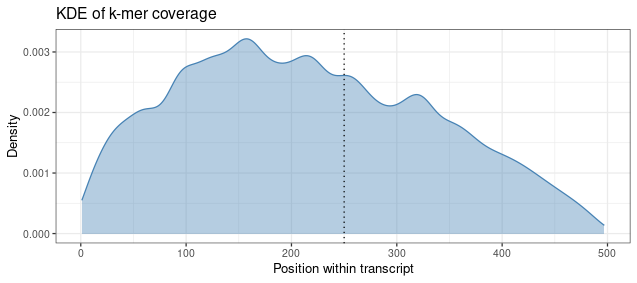

## What is the k-mer ratio?

Typically, k-mer based data structures define a threshold to decide if the query is contained within a sample. Given a threshold $$\theta \geq x$$, it is reasonably likely that the query sequence was within the sample. In other words, if a certain fraction of k-mers along the query can be detected in the sample, we can approximate that the sequence was originally expressed in the sample.

In our benchmarks, we observed that 70% was a good cutoff to differentiate expressed from non-expressed sequences. This was the case for splice junctions (*in silico* and qPCR validated) and full-length transcript sequences.

## What is the sample rate?

Since k4neo uses binary presence/absence data structures, we can only provide yes/no answers for individual samples. Therefore, we aggregate presence calls of samples by tissue, developmental stage, and disease to provide expression profiles for input sequences.

A sample rate of 0.6 means 60% of the samples of this tissue [expressed the sequence](faq.md#what-is-the-k-mer-ratio).


## Can I plot the k-mer coverage (density) along the sequence when using quant mode?

After running k4neo-quant, you can use the parsed Jellyfish output to plot the coverage/density along the query sequence. This can be helpful for QC or checking if a position of interest is covered compared to the surrounding wild-type sequence.

```R
library(tidyverse)
library(ggplot2)

# Read input
df <- read_tsv("query/jellyfish/DRR016702/quantitative_search.tsv", col_names = F)
# Group by sequence and add starting positions of k-mers for plotting

df <- df %>%
  group_by(X1) %>%
  mutate(pos = 1:n()) %>%
  dplyr::ungroup()

# This is just an example
plot_df <- df %>% dplyr::filter(X1=="bf20e4058a136ab64c7d015e61651248")
L = 497 + 21
k = 21

# Plot KDE density of coverage values along the sequence.
ggplot(plot_df, aes(x = pos, weight = X3)) +
  geom_density(
    bw = 10,
    color = "steelblue",
    fill = "steelblue",
    alpha = 0.4
  ) +
  labs(
    title = "KDE of k-mer coverage",
    x = "Position within transcript",
    y = "Density"
  ) +
  # Add position of interest as vline
  geom_vline(xintercept = 250, linetype = "dotted") +
  theme_bw()

```

{: style="width:50%"}

In this example, we can see that the sequence has more coverage at the 5' end. This could be attributed to 5' bias in the sequencing data. Our example position of interest fits into the coverage profile along the sequence.