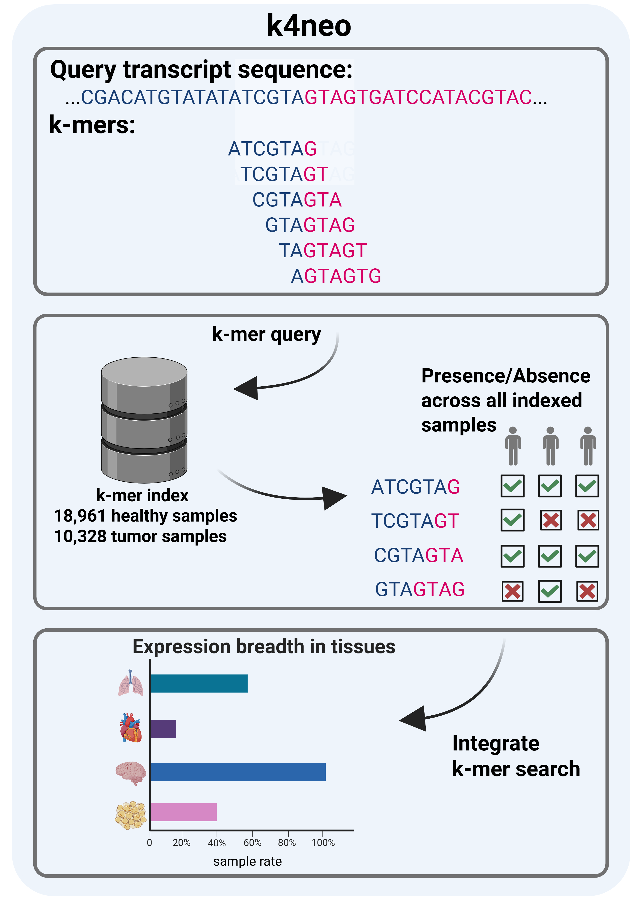

# k4neo

<!-- badges: start -->

<!-- badges: end -->

**Predicting tumor-specificity in a blast. A modern k-mer based approach to screen for (neo)antigens in healthy and tumor tissue RNA-seq**

--- 

k4neo is an open source python package that enables easy screening of target sequences against a sequence database generated from a set of defined control samples. This packages handles index generation and annotation of targets with information about expression in healthy and cancer tissue samples to select potential (neo)antigen candidates. Currently, k4neo supports large-scale binary presence/absence annotation and limited quantitative search in RNA-seq samples. 

The k4neo package provides several commands:  
    `k4neo-annotator`  
    `k4neo-database`  
    `k4neo-ref-index`  
    `k4neo-uniq`  
    `k4neo-plotter`  
    `k4neo-quant`  

{: style="width:50%"}

### Binary presence/absence annotation

k4neo (`k4neo-annotator`) performs annotation of expression breadth in GTEx and TCGA data using binary presence/absence k-mer datastructures. By default, we utilize `Raptor hibf w,k` using $$k=21, w=25$$. Users can optionally also query `kmindex` indices when provided in the manifest file. k4neo takes every sequence provided in the input file and searches them against the indices provided in the index manifest file. Next, query results are annotated with sample level metadata and aggregated to obtain expression breadth/profiles across all healthy and tumor tissues.

### Metadata database

k4neo stores metadata of indexed samples in a SQLite3 database. Please refer to [kmer-index-data](https://github.com/TRON-Private/kmer_index_data) repository for information about structured metadat and how to build the database.

### Reference index

